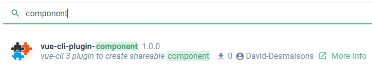
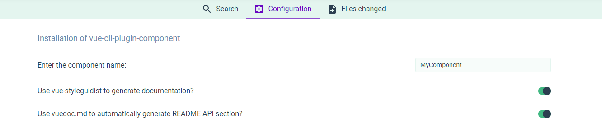

# vue-cli-plugin-component
[](https://www.npmjs.com/package/vue-cli-plugin-component)
[](https://npmjs.com/package/vue-cli-plugin-component)
[](https://github.com/David-Desmaisons/vue-cli-plugin-component/blob/master/LICENSE)
> component plugin for vue-cli



```
project
│   README.md
│   LICENSE (optional)
└───src
│   ├── index.js
│   └───components
│       └───Mycomponent.vue
│
└───example
    ├── App.vue
    ├── main.js
```

## Features

* Adjust build script to only build the component. Use serve script to serve a demo page.

* Create a prepublishOnly script to run the build(s) before publishing the component

* Update README.md with component information

* Optional
    * Use [ComponentFixture](https://github.com/David-Desmaisons/ComponentFixture) to develop and test the component

    * Automatically document the component with [vue-styleguidist](https://github.com/vue-styleguidist/vue-styleguidist) and [vuedoc.md](https://gitlab.com/vuedoc/md) .

    * Create a license file for the project

    * Add projects badges

## Scripts

Use build to build the component
``` sh
npm run build
```

Use serve to serve the application example in the example folder
``` sh
npm run serve
```

### When using vue.doc

Use doc:build to update the API section of README.md with generated documentation
```
npm run doc:build
```

### When using vueStyleguide

Use styleguide to run style guide dev server
```
npm run styleguide
```

Use styleguide:build to generate a static HTML style guide
```
npm run styleguide:build
```


## Configuration




* **componentName:** the name of the component.

* **useVueStyleguidist:** true to install [vue-styleguidist](https://github.com/vue-styleguidist/vue-styleguidist), default: true

* **useVueDoc:** true to install [vuedoc.md](https://gitlab.com/vuedoc/md), default: true

* **addLicense** true to add a License file to the project, default: false

* **licenseName** type of the license file to create, default: MIT

* **copyrightHolders** Project copy holders, used when creating the license file.

## Injected Commands

No command will be injected.


## Installing in an Already Created Project

``` sh
vue add component
```

## Injected webpack-chain Rules
No Changes are performed
